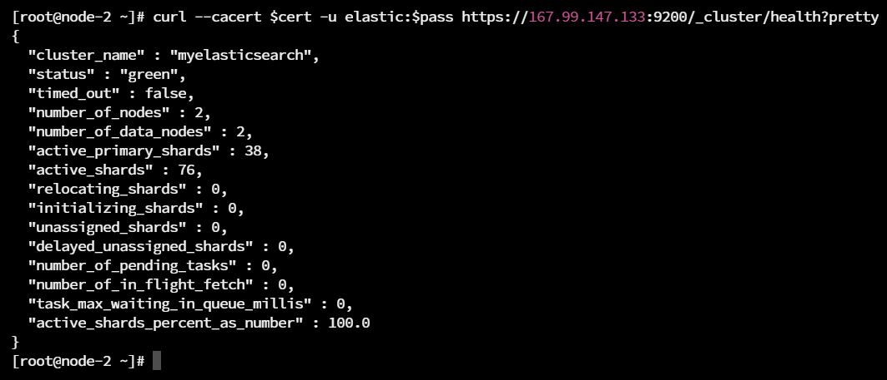
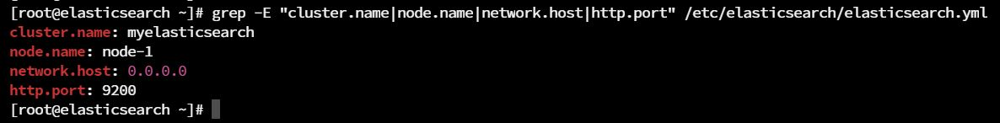
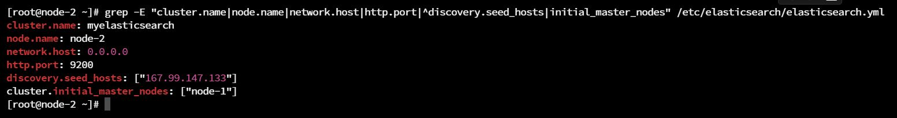
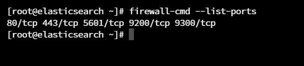
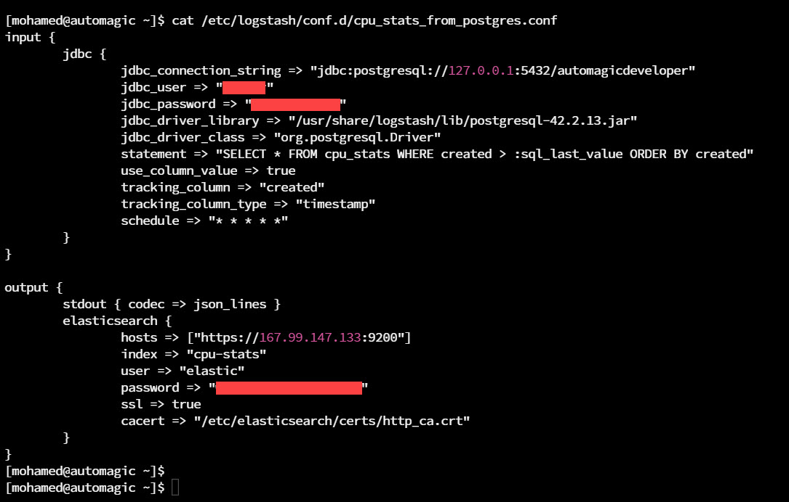
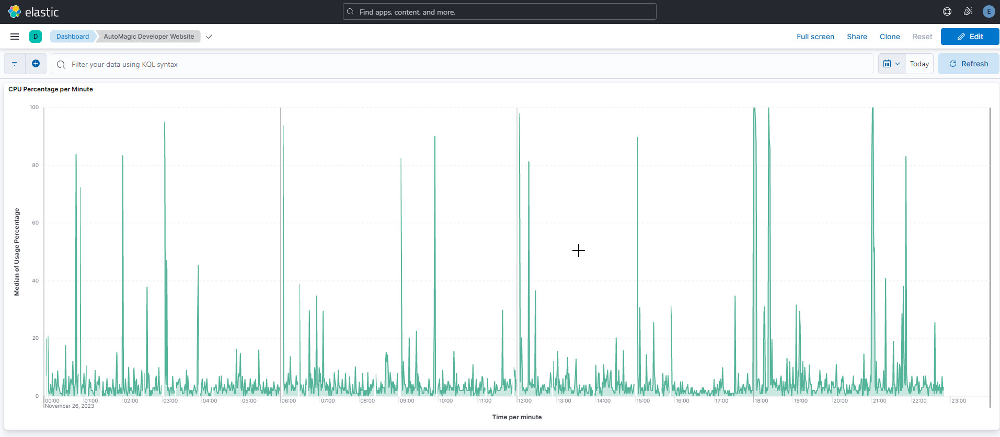

[![LinkedIn][linkedin-shield]][linkedin-url]

<!-- PROJECT LOGO -->
 

  
  <h3 align="center">Multi-Node Elasticsearch Cluster Setup With Kibana and Logstash</h3>

<!-- TABLE OF CONTENTS -->

  
Table of Contents

  <ol>
    <li>
      <a href="#about-the-project">About The Project</a>
      <ul>
        <li><a href="#description">Description</a></li>
      </ul>
    </li>
    <li><a href="#contact">Contact</a></li>
  </ol>

<!-- ABOUT THE PROJECT -->
## About The Project

* Project Name: Multi-Node Elasticsearch Cluster Setup With Kibana and Logstash
* Version: v1.0.0
* Organization Department: Technology

### Description
In this project, I configured a multi-node Elasticsearch cluster, connected it to Kibana, 
and used Logstash to create a pipeline from Postgres database to Elasticsearch. 
The pipeline extracts the CPU usage of my personal website from the Postgres database,
then load it into an index in Elasticsearch. Finally, I visualized that data 
inside a line graph in a dashboard in Kibana.

#### Main Features:

**1. Elasticsearch Cluster Configuration:**

* Installed Elasticsearch v8.11 on RHEL 9.2.
* Linked Elasticsearch with Kibana using an enrollment token.
* Configured cluster settings in the elasticsearch.yml file, including: 
  * cluster name
  * node name
  * network host
  * HTTP port
* Prepared the cluster for the addition of another node.

**2. Multi-Node Setup:**

* Added a second node to the Elasticsearch cluster on a separate RHEL 9.2 server.
* Configured node settings in elasticsearch.yml, including: 
  * cluster name
  * node name
  * network host
  * HTTP port
  * discovery seed hosts
  * initial master nodes
* Initiated the new node with a generated enrollment token from the master node.

**3. Firewall Configuration:**

Allowed traffic on both the HTTP port (9200) and Transport Port (9300) for seamless communication between nodes.

**4. Using Logstash to Integrate Postgres database with Elasticsearch:**
* Installed Logstash on a server hosting a Postgres database which contains the
CPU usage data of my personal website.
* Enabled the Logstash service to restart automatically on system restart.
* Created a pipeline to extract the CPU data from the Postgres database and load
it into Elasticsearch for centralized storage and analysis.

**5. Data Visualization with Kibana:**

* Established a connection between Kibana and the Elasticsearch cluster.
* Created a dashboard in Kibana.
* Added a dynamic line graph to visualize the CPU usage data retrieved 
from the personal website's database.

(<a href="#readme-top">back to top</a>)

<!-- CONTACT -->
## Contact

Mohamed AbdelGawad Ibrahim - [@m-abdelgawad](https://www.linkedin.com/in/m-abdelgawad/) - <a href="tel:+201069052620">+201069052620</a>

(<a href="#readme-top">back to top</a>)

<!-- MARKDOWN LINKS & IMAGES -->
<!-- https://www.markdownguide.org/basic-syntax/#reference-style-links -->
[linkedin-shield]: https://img.shields.io/badge/-LinkedIn-black.svg?style=for-the-badge&logo=linkedin&colorB=555
[linkedin-url]: https://www.linkedin.com/in/m-abdelgawad/
